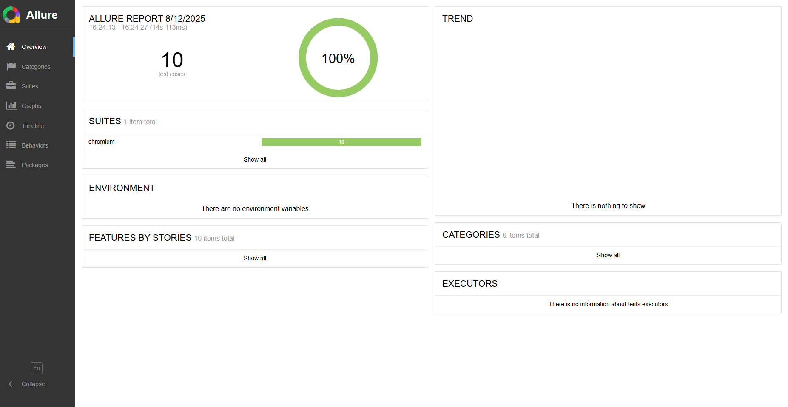

# bugpoint Tracker - баг трекер для QA инженеров

### Запуск проекта

1. Скопируйте себе на устройство репозиторий

    `git clone https://github.com/depedence/bugpoint-tracker-qa.git`

2. Создайте файл в папке data (если её нет, то создайте папку ../backend/data), куда будут сохраняться созданные тикеты

    `touch  backend/data/bugs.json`

3. Установите зависимости

    `npm install`

4. Установите Chromium для Playwright тестов

    `npx playwright install`

5. Команды запуска

    `npm run start:backend` - запуск бэкэнда

    `npm run start:frontend` - запуск фронтэнда

    `npm run dev` - запуск всего проекта

## Функции и возможности bugpoint Tracker

В основном направлен на то, чтобы показать hard skills QA, но также может нести в себе
полезные свойства.

- Создание тикета (название, описание, приоритет и статус)
- Удаление тикета
- drag-and-drop перемещение тикера в другой столбец (изменение его статуса)
- Редактирование тикета в модалке

## Запуск Playwright тестов с отчётами в Allure

- Выполните команду `npm run test:report`, чтобы запустить тесты и создать отладку с Allure
- Выполните команду `npm run test`, чтобы запустить тесты без отчёта Allure
- Выполните команду `npm run test:ui`, чтобы запустить тесты с внутренним отчетом Playwright

#

_Проект всё ещё находится в разработке..._
